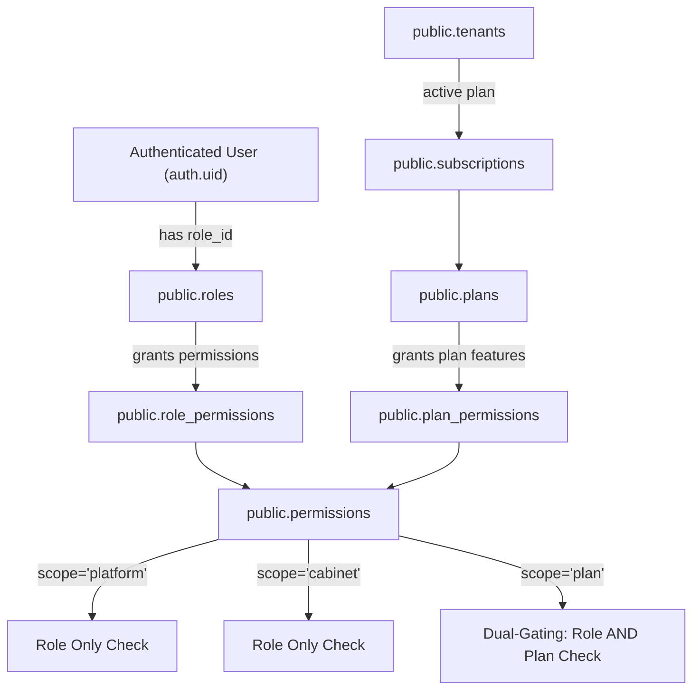

# Technical Architecture Reference — Cabinets Platform

> **Last Updated**: August 2026  

---

## 1. Tech Stack Overview

| Layer | Technology / Library | Version / Details |
| :--- | :--- | :--- |
| **Framework** | Next.js (App Router) | `16.1.4` (React 19 / TypeScript 5) |
| **Database & Auth** | Supabase (PostgreSQL) | PostgreSQL 15+, Supabase Auth, RLS |
| **Styling & UI** | Vanilla CSS / Tailwind CSS | Tailwind CSS v4, Shadcn UI primitives, Lucide Icons |
| **Encryption** | PostgreSQL `pgcrypto` | AES-256-GCM for Google Drive OAuth tokens |
| **Cloud Storage Integration** | Google Drive REST API v3 | Multipart Resumable Uploads & Folder Automation |
| **Deployment Model** | Serverless / Node.js | Next.js Server Components & Server Actions |

---

## 2. Authorization Architecture

The platform uses a **Dynamic Role-Based Access Control (RBAC)** architecture with **Plan-Based Feature Gating (Dual-Gating)**.

### 2.1 Role Model (`public.roles`)
- **System Platform Roles** (`is_platform_role = true`, `is_system = true`):
  - `super_admin`: Platform administrator with global access across all tenants and plans.
- **System Cabinet Staff Roles** (`is_platform_role = false`, `is_system = true`):
  - `cabinet_admin`: Tenant administrator. Manages team members, branding, BYOS storage, and clients.
  - `accountant`: Cabinet accounting staff. Manages client documents, uploads files, views client portfolios.
- **System Client Portal Roles** (`is_platform_role = false`, `is_system = true`):
  - `client`: External cabinet client contact. Access restricted to their specific client portal (`/portal`).

### 2.2 Permission Model (`public.permissions`)
Each permission has a `key`, `label`, `category`, and a strict `scope`:
- **`scope = 'platform'`**: Exclusive to platform roles (`super_admin`). Evaluates role entitlement only.
- **`scope = 'cabinet'`**: Granted to cabinet staff system roles. Evaluates role entitlement only (never consults plan permissions).
- **`scope = 'plan'`**: Gated by subscription plan tier (e.g. `branding:customize`, `drive:connect`). Requires **both** role entitlement AND plan entitlement (`can_perform_with_plan`).

### 2.3 Core Authorization Primitives (RPC Signatures)

| RPC Name | Signature | Purpose & Behavior |
| :--- | :--- | :--- |
| `is_super_admin()` | `() -> BOOLEAN` | Returns `true` if `auth.uid()` has role `super_admin`. |
| `is_platform_role()` | `() -> BOOLEAN` | Returns `true` if `auth.uid()` belongs to a role with `is_platform_role = true`. |
| `has_permission(perm_key)` | `(perm_key TEXT) -> BOOLEAN` | Checks if `auth.uid()`'s role is granted `perm_key` in `role_permissions`. |
| `can_perform(perm_key)` | `(perm_key TEXT) -> BOOLEAN` | Evaluates `is_super_admin() OR has_permission(perm_key)`. |
| `has_plan_permission(p_tenant_id, p_permission_key)` | `(p_tenant_id UUID, p_permission_key TEXT) -> BOOLEAN` | Checks if `p_tenant_id`'s active plan includes `p_permission_key` in `plan_permissions`. |
| `check_plan_limit(p_limit_key, p_tenant_id)` | `(p_limit_key TEXT, p_tenant_id UUID DEFAULT NULL) -> JSONB` | Atomic quota enforcer (`max_accountants`, `max_clients`, `max_storage_gb`). Returns `{ allowed, limit_key, current_count, max_allowed }`. |
| `can_perform_with_plan(required_permission, target_tenant_id)` | `(required_permission TEXT, target_tenant_id UUID DEFAULT NULL) -> BOOLEAN` | Enforces Dual-Gating: `is_super_admin() OR (can_perform() AND (scope != 'plan' OR has_plan_permission()))`. |
| `get_my_tenant_id()` | `() -> UUID` | SECURITY DEFINER helper returning caller's `tenant_id` from `public.users`. |
| `get_my_client_id()` | `() -> UUID` | SECURITY DEFINER helper returning caller's `client_id` from `public.users`. |
| `is_client_role()` | `() -> BOOLEAN` | Returns `true` if `auth.uid()` belongs to role `client`. |

### 2.4 Three-Tier Route Architecture (`proxy.ts`)
Routing and access control are enforced centrally in `proxy.ts` middleware:

1. **Platform Zone (`/super-admin/*`)**:
   - Access: `is_platform_role() = true`.
   - Redirect: Non-platform users attempting access are redirected to `/dashboard` (or `/portal`).
2. **Cabinet Staff Zone (`/dashboard/*`)**:
   - Access: `is_platform_role() = false` AND `is_client_role() = false`.
   - Redirect: Platform roles redirected to `/super-admin`; `client` roles redirected to `/portal`. Checks tenant status (redirects to `/suspended` if tenant status is `suspended`).
3. **Client Portal Zone (`/portal/*`)**:
   - Access: `is_client_role() = true`.
   - Redirect: Non-client roles redirected to `/dashboard` (or `/super-admin`).

### 2.5 Legacy Artifacts Preserved for Burn-in
- `users.role_legacy` (`public.user_role` enum): Preserved column kept for schema compatibility during migration.
- `subscriptions.plan_legacy` (`public.subscription_plan` enum): Preserved column kept for burn-in.
- `get_my_role()`: Deprecated helper function returning `users.role_legacy`.

---

## 3. Database Schema Reference

### 3.1 `public.tenants`
Stores cabinet organizations.
- **Columns**: `id` (UUID, PK), `name` (TEXT), `status` (TEXT: `'pending'`, `'active'`, `'suspended'`), `drive_folder_id` (TEXT), `drive_refresh_token` (TEXT encrypted), `brand_logo_url` (TEXT), `brand_primary_color` (TEXT), `brand_secondary_color` (TEXT), `branding_prompt_dismissed` (BOOLEAN), `created_at`, `updated_at`.
- **RLS Policies**:
  - `tenant_isolation_tenants_select`: `is_super_admin() OR id = get_my_tenant_id()`.
  - `tenant_isolation_tenants_update`: `(id = get_my_tenant_id() AND can_perform('branding:customize')) OR is_super_admin()`.

### 3.2 `public.users`
Stores user profile attributes linked to `auth.users`.
- **Columns**: `id` (UUID, PK, REFERENCES `auth.users`), `email` (TEXT), `tenant_id` (UUID, FK `tenants`), `role_id` (UUID, FK `roles`), `role_legacy` (ENUM), `title` (TEXT), `client_id` (UUID, FK `clients`), `created_at`, `updated_at`.
- **RLS Policies**:
  - `users_select_own`: `id = auth.uid()`.
  - `tenant_isolation_users_select_cabinet_admin`: `tenant_id = get_my_tenant_id() AND (is_super_admin() OR has_permission('team:view'))`.
  - `users_update_own_title`: `id = auth.uid()`.

### 3.3 `public.roles`
Defines system and custom RBAC roles.
- **Columns**: `id` (UUID, PK), `name` (TEXT, UNIQUE), `is_system` (BOOLEAN), `is_platform_role` (BOOLEAN), `tenant_id` (UUID, FK `tenants`), `created_at`.
- **RLS Policies**:
  - `allow_authenticated_read_roles`: `auth.role() = 'authenticated'`.
  - `protect_system_roles_update_delete`: Trigger prevents modification/deletion of `is_system = true` roles.

### 3.4 `public.permissions`
Catalog of system permission definitions.
- **Columns**: `id` (UUID, PK), `key` (TEXT, UNIQUE), `label` (TEXT), `category` (TEXT), `scope` (TEXT: `'platform'`, `'cabinet'`, `'plan'`), `created_at`.
- **RLS Policies**:
  - `permissions_select_all`: `auth.role() = 'authenticated'`.

### 3.5 `public.role_permissions`
Join table mapping roles to permissions.
- **Columns**: `role_id` (UUID, FK `roles`), `permission_id` (UUID, FK `permissions`). Composite PK (`role_id`, `permission_id`).

### 3.6 `public.plans`
Catalog of subscription pricing plans.
- **Columns**: `id` (UUID, PK), `name` (TEXT), `slug` (TEXT, UNIQUE), `description` (TEXT), `price_monthly` (NUMERIC), `currency` (TEXT DEFAULT `'MAD'`), `tier_rank` (INT), `is_active` (BOOLEAN), `is_recommended` (BOOLEAN), `created_at`, `updated_at`.
- **RLS Policies**:
  - `plans_select_all`: `auth.role() = 'authenticated'`.

### 3.7 `public.plan_permissions`
Join table mapping plans to `scope='plan'` permissions.
- **Columns**: `plan_id` (UUID, FK `plans`), `permission_id` (UUID, FK `permissions`). Composite PK (`plan_id`, `permission_id`).

### 3.8 `public.plan_limits`
Defines numeric quotas per plan.
- **Columns**: `id` (UUID, PK), `plan_id` (UUID, FK `plans`), `limit_key` (TEXT), `limit_value` (INT). Unique constraint (`plan_id`, `limit_key`).

### 3.9 `public.subscriptions`
Tenant plan assignments.
- **Columns**: `id` (UUID, PK), `tenant_id` (UUID, FK `tenants`), `plan_id` (UUID, FK `plans`), `plan_legacy` (ENUM), `status` (TEXT), `current_period_start`, `current_period_end`, `cancel_at_period_end`, `created_at`, `updated_at`.
- **RLS Policies**:
  - `tenant_isolation_subscriptions_select`: `is_super_admin() OR tenant_id = get_my_tenant_id()`.

### 3.10 `public.clients`
Cabinet client records.
- **Columns**: `id` (UUID, PK), `tenant_id` (UUID, FK `tenants`), `name` (TEXT), `client_type` (TEXT: `'company'`, `'individual'`), `email` (TEXT), `phone` (TEXT), `status` (TEXT: `'active'`, `'archived'`), `drive_folders` (JSONB), `created_by` (UUID, FK `users`), `auth_user_id` (UUID, UNIQUE FK `users`), `created_at`, `updated_at`.
- **RLS Policies**:
  - `tenant_isolation_clients_select`: `(tenant_id = get_my_tenant_id() AND is_client_role() AND id = get_my_client_id()) OR (tenant_id = get_my_tenant_id() AND NOT is_client_role()) OR is_super_admin() OR is_platform_role()`.
  - `tenant_isolation_clients_insert`: `(tenant_id = get_my_tenant_id() OR is_super_admin() OR is_platform_role()) AND (is_platform_role() OR can_perform('team:manage') OR can_perform('team:invite') OR has_permission('branding:customize'))`.
  - `tenant_isolation_clients_update`: `(tenant_id = get_my_tenant_id() OR is_super_admin() OR is_platform_role())`.
  - `tenant_isolation_clients_delete`: `(tenant_id = get_my_tenant_id() OR is_super_admin() OR is_platform_role())`.

### 3.11 `public.documents`
GED metadata records linked to Google Drive files.
- **Columns**: `id` (UUID, PK), `tenant_id` (UUID, FK `tenants`), `client_id` (UUID, FK `clients`), `category` (TEXT CHECK: `'charges'`, `'salaires'`, `'comptes'`, `'contrats'`, `'documents_generaux'`), `drive_file_id` (TEXT), `drive_web_view_link` (TEXT), `file_name` (TEXT), `file_size_bytes` (BIGINT), `mime_type` (TEXT), `uploaded_by` (UUID, FK `users`), `created_at`.
- **RLS Policies**:
  - `tenant_isolation_documents_select`: `(tenant_id = get_my_tenant_id() AND is_client_role() AND client_id = get_my_client_id()) OR (tenant_id = get_my_tenant_id() AND NOT is_client_role()) OR is_super_admin() OR is_platform_role()`.
  - `tenant_isolation_documents_insert`: `(tenant_id = get_my_tenant_id() OR is_super_admin() OR is_platform_role()) AND (is_platform_role() OR has_permission('documents:upload'))`.
  - `tenant_isolation_documents_delete`: `(tenant_id = get_my_tenant_id() OR is_super_admin() OR is_platform_role()) AND (is_platform_role() OR has_permission('documents:delete'))`.

### 3.12 `public.logs`
Audit logging table for critical security and tenant events.
- **Columns**: `id` (UUID, PK), `tenant_id` (UUID, FK `tenants`), `user_id` (UUID, FK `users`), `action` (TEXT), `metadata` (JSONB), `created_at`.

---

## 4. Multi-Tenancy & Plan System

### 4.1 Tenant Isolation
Multi-tenancy is enforced natively at the database layer via **Row-Level Security (RLS)**. Every tenant table contains a `tenant_id` foreign key referencing `public.tenants(id)`. RLS policies evaluate `tenant_id = get_my_tenant_id()`.

### 4.2 Core Plan Catalog Structure

| Plan Name | Slug | Tier Rank | Price / Month | Max Accountants | Max Clients | Max Storage | Included Permissions |
| :--- | :--- | :---: | :---: | :---: | :---: | :---: | :--- |
| **Essai Gratuit** | `trial` | 0 | 0 MAD | 1 | 3 | 5 GB | Standard features |
| **Starter** | `starter` | 10 | 290 MAD | 5 | 10 | 25 GB | `drive:connect`, `drive:disconnect` |
| **Pro** | `pro` | 20 | 790 MAD | Unlimited (-1) | Unlimited (-1) | 100 GB | `drive:connect`, `drive:disconnect`, `branding:customize` |

---

## 5. Google Drive BYOS Integration

### 5.1 Connection Flow
1. Cabinet Admin initiates Google OAuth 2.0 consent flow.
2. Callback route exchanges authorization code for refresh token.
3. Refresh token is encrypted using AES-256-GCM via `pgcrypto` RPC `save_tenant_drive_token(p_refresh_token)` and stored in `tenants.drive_refresh_token`.
4. Access tokens are minted on-demand server-side using `getGoogleDriveClient(tenantId)`.

### 5.2 Folder Automation & Document Pipeline
When a new client is created via `createClientAction`:
1. **Root Folder Creation**: Creates `Client Name` root folder in cabinet's Drive.
2. **Subfolder Tree**: Creates 5 standard subfolders:
   - `Charges`
   - `Salaires`
   - `Comptes`
   - `Contrats`
   - `Documents Généraux`
3. **Drive Metadata Storage**: Stores subfolder Drive IDs in `clients.drive_folders` JSONB.

### 5.3 Rollback & Cleanup Guarantee
- **Client Creation Partial Failure**: If Google Drive API throws an error during subfolder creation, `createClientAction` calls `delete_client_record` RPC to delete the database record and attempts best-effort deletion (`deleteFolder`) of the created root folder on Drive.
- **Document Upload Failure**: If database insertion into `public.documents` fails after a file upload, `uploadDocumentAction` executes an explicit `deleteFile(driveFileId)` cleanup call to Google Drive API.

---

## 6. Client Portal

### 6.1 Linkage Model
- `clients.auth_user_id` $\leftrightarrow$ `users.client_id` (1-to-1 linkage).
- `handle_new_user()` trigger auto-assigns `role_id` for role `client` when metadata `role: 'client'` is passed.

### 6.2 Invitation Mechanism
1. Cabinet Admin clicks **Inviter le client** on `/dashboard/clients`.
2. `inviteClientAction(clientId, email)` verifies `cabinet_admin` / `team:manage` permission.
3. Invites user via Supabase Auth `inviteUserByEmail` passing `{ role: 'client', tenant_id, client_id }`.
4. Links `clients.auth_user_id` and `users.client_id`. User completes set-password flow via `/accept-invite`.

### 6.3 Isolation Scope
- Clients are strictly restricted via RLS (`WHERE client_id = get_my_client_id()`).
- `proxy.ts` forces `client` role users to `/portal` only.

---

## 7. Key Server Actions & RPCs Reference

| Name | Location / Scope | Type | Purpose | Auth Check |
| :--- | :--- | :--- | :--- | :--- |
| `createClientAction` | `app/dashboard/clients/actions.ts` | Server Action | Creates client record & initializes 5 Drive subfolders | `can_perform('team:manage')` / `check_plan_limit('max_clients')` |
| `inviteClientAction` | `app/dashboard/clients/actions.ts` | Server Action | Invites external client contact to portal | `cabinet_admin` role / `can_perform('team:manage')` |
| `uploadDocumentAction` | `app/dashboard/documents/actions.ts` | Server Action | Uploads file to Drive subfolder & inserts document row | `has_permission('documents:upload')` |
| `inviteStaffAction` | `app/dashboard/actions.ts` | Server Action | Invites new cabinet staff member | `can_perform('team:invite')` / `check_plan_limit('max_accountants')` |
| `updateBrandingAction` | `app/dashboard/settings/branding-actions.ts` | Server Action | Updates cabinet logo and HSL theme colors | `can_perform_with_plan('branding:customize')` |
| `createPlanAction` | `app/super-admin/plans-actions.ts` | Server Action | Creates a new pricing plan and quotas | `is_super_admin()` |
| `updatePlanAction` | `app/super-admin/plans-actions.ts` | Server Action | Updates pricing plan details and quotas | `is_super_admin()` |
| `create_tenant_account` | Database RPC | SECURITY DEFINER | Creates tenant, admin user, and initial subscription | System / Initial Onboarding |
| `upsert_plan_details` | Database RPC | SECURITY DEFINER | Atomic creation/update of plan, permissions & limits | `is_super_admin()` |
| `check_plan_limit` | Database RPC | SECURITY DEFINER | Quota calculation and enforcement | `auth.role() = 'authenticated'` |
| `save_tenant_drive_token` | Database RPC | SECURITY DEFINER | Encrypts & saves Google Drive OAuth refresh token | `can_perform_with_plan('drive:connect')` |

---

## 8. Known Limitations & Accepted Gaps

1. **Storage Limit Enforcement (`max_storage_gb`)**: `max_storage_gb` is defined in `plan_limits` as a quota placeholder, but file-size sum enforcement across Google Drive files is not enforced in v1.
2. **Direct Google Drive Links in Portal**: `/portal` currently uses `drive_web_view_link` directly for document viewing rather than a server-signed proxy stream endpoint.
3. **Cabinet-Wide Client Visibility**: Accountants can view all clients belonging to their tenant. Client-to-accountant assignment (scoping accountants to specific clients) is deferred.
4. **Single Contact per Client**: Each `clients` record supports exactly one primary auth login (`auth_user_id`). Multi-contact logins for corporate clients are deferred.
5. **No Dedicated Notifications Table**: Staff dashboard alert badges use simple user timestamp comparisons (`last_dashboard_viewed_at` pattern) rather than a persistent notifications queue.
