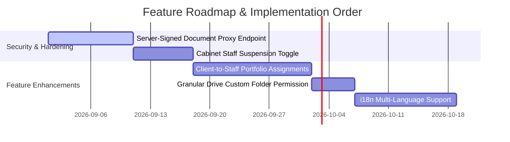

# Project Roadmap & Technical Recommendations — Cabinets Platform

> **Document Type**: Prioritized Backlog & Technical Guidance  
> **Target Audience**: Development Team & Product Architecture  
> **Last Updated**: August 2026  

---


## Prioritized Feature & Hardening Backlog



---

### 1. Server-Signed Document Proxy Endpoint (Near-Term Security Hardening)

- **Description**: Currently, the Client Portal (`/portal/page.tsx`) renders direct `drive_web_view_link` URLs for document consultation. While functional, exposing raw Google Drive web view links carries security risks if folder permissions are misconfigured on Google Drive.
- **Proposed Solution**:
  1. Build a secure Next.js API route / Server Action `GET /api/documents/[id]/download` (or `streamDocumentAction`).
  2. Verify that the calling user session owns the document (`client_id = get_my_client_id()`).
  3. Stream the file bytes directly from Google Drive API using `getGoogleDriveClient(tenantId)` with a `Content-Disposition: inline` header, or generate a short-lived, signed download token.
- **Why It Matters**: Prevents end clients from accessing the raw Google Drive folder structure or inadvertently gaining edit/delete privileges on the cabinet's internal Google Drive account.
- **Relative Size & Risk**: **Medium Effort / Medium Risk**. Requires testing stream performance for large PDF and Excel files.

---

### 2. Cabinet Staff Account Suspension

- **Description**: Currently, a `cabinet_admin` can invite team members and modify their titles on `/dashboard/team`, but cannot temporarily disable or suspend an accountant's access without deleting their user record entirely.
- **Proposed Solution**:
  1. Add a `status` column to `public.users` (`CHECK (status IN ('active', 'suspended')) DEFAULT 'active'`) or a `suspended_at TIMESTAMPTZ` column.
  2. Update authorization helper RPCs (`has_permission`, `can_perform`, `can_perform_with_plan`) to return `false` if `users.status = 'suspended'`.
  3. Wire a **"Suspendre" / "Réactiver"** toggle button on `/dashboard/team` executing a dedicated Server Action `toggleUserSuspensionAction`.
- **Why It Matters**: Allows cabinet administrators to instantly revoke system access when an employee leaves or goes on extended leave, without destroying historical audit trails or document upload attribution.
- **Relative Size & Risk**: **Small Effort / Low Risk**. Contained schema migration and UI toggle.

---

### 3. Client-to-Staff Portfolio Assignments (Granular Access Control)

- **Description**: Currently, all accountants in a cabinet can view all clients and all client documents belonging to their tenant. As cabinets scale, administrators need to assign specific client portfolios to specific accountants.
- **Proposed Solution**:
  1. Create a `public.client_assignments` join table:
     ```sql
     CREATE TABLE public.client_assignments (
         client_id UUID NOT NULL REFERENCES public.clients(id) ON DELETE CASCADE,
         user_id UUID NOT NULL REFERENCES public.users(id) ON DELETE CASCADE,
         created_at TIMESTAMPTZ NOT NULL DEFAULT now(),
         PRIMARY KEY (client_id, user_id)
     );
     ```
  2. Update RLS policies on `public.clients` and `public.documents`:
     - `cabinet_admin` retains full cabinet-wide visibility.
     - `accountant` visibility is restricted to clients assigned to them in `client_assignments` (`EXISTS (SELECT 1 FROM client_assignments WHERE client_id = clients.id AND user_id = auth.uid())`).
  3. Add a portfolio assignment selector UI in `/dashboard/clients` and `/dashboard/team`.
- **Why It Matters**: Essential for medium and large accounting firms managing hundreds of client companies across divided accounting teams.
- **Relative Size & Risk**: **Medium Effort / Medium Risk**. Requires Design-Lock review due to RLS policy updates on core tables.

---

### 4. Custom Google Drive Folder Permission (`drive:create_folder`)

- **Description**: Currently, client Google Drive folder trees are auto-generated with 5 fixed subfolders (`Charges`, `Salaires`, `Comptes`, `Contrats`, `Documents Généraux`). Cabinet staff cannot create ad-hoc custom subfolders through the platform.
- **Proposed Solution**:
  1. Add a new permission definition:
     ```sql
     INSERT INTO public.permissions (key, label, category, scope)
     VALUES ('drive:create_folder', 'Création de dossiers personnalisés Drive', 'cabinet', 'plan');
     ```
  2. Wire `drive:create_folder` into `plan_permissions` for `pro` and `enterprise` plans.
  3. Add a **"Nouveau Dossier"** dialog on `/dashboard/clients` allowing authorized staff to create custom category subfolders on Google Drive.
- **Why It Matters**: Gives accounting cabinets flexibility for specialized client industries requiring custom document structures (e.g. `Fiscalité Internationale`, `Audits`).
- **Relative Size & Risk**: **Small Effort / Low Risk**. Reuses existing `createFolder` Google Drive client method.

---

### 5. Internationalization & Multi-Language Support (i18n)

- **Description**: The platform interface is currently French-only (`fr-FR`). As the platform expands beyond regional markets, multi-language support will be required.
- **Proposed Solution**:
  1. Integrate an i18n framework suitable for Next.js App Router (e.g. `next-intl`).
  2. Extract hardcoded French strings from UI components and Server Action error messages into structured JSON translation dictionaries (`messages/fr.json`, `messages/en.json`).
  3. Add a user language preference selector in the user dropdown and tenant settings.
- **Why It Matters**: Enables international expansion and caters to multi-lingual accounting firms and foreign client contacts.
- **Relative Size & Risk**: **Medium Effort / Low Risk**. Refactoring task without database schema risk.

---

## Summary Matrix

| Recommendation | Category | Priority | Effort | Risk Level | Target Phase |
| :--- | :--- | :---: | :---: | :---: | :---: |
| **Server-Signed Document Proxy** | Security Hardening | High | Medium | Medium | Phase 3.1 |
| **Cabinet Staff Suspension** | User Management | High | Small | Low | Phase 3.1 |
| **Client Portfolio Assignments** | Access Control | Medium | Medium | Medium | Phase 4.0 |
| **Custom Drive Folders (`drive:create_folder`)** | Drive Feature | Medium | Small | Low | Phase 4.0 |
| **i18n Multi-Language Support** | UX & Expansion | Low | Medium | Low | Future Roadmap |
